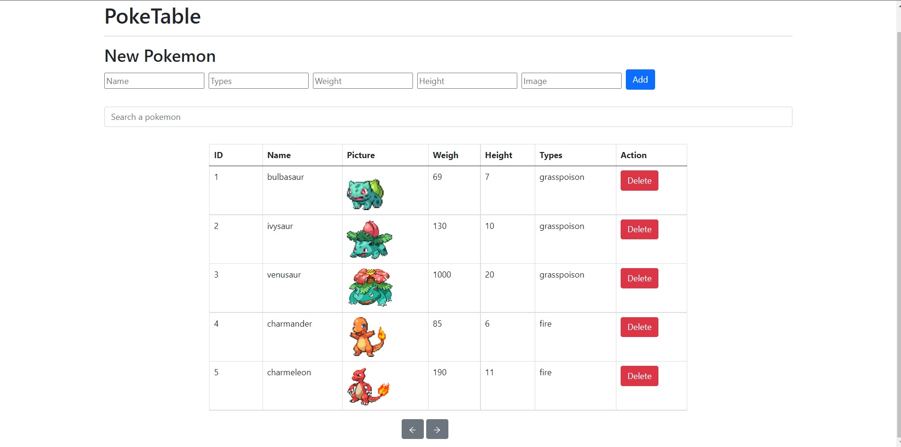

# Tabla Dinamica Pokemon

En este proyecto se creo una tabla dinamica de pokemon, con la cual se podra visualizar los datos de los pokemon.

Podemos ver los datos de los pokemon en la tabla, y tambien podemos agregar un nuevo pokemon a la tabla. De igual manera podemos eliminar un pokemon de la tabla. 

Hecha unicamente con React.js y Bootstrap. 

# Imagen Presentacional

  

